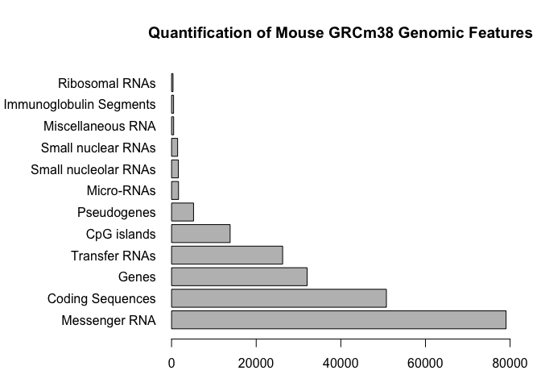
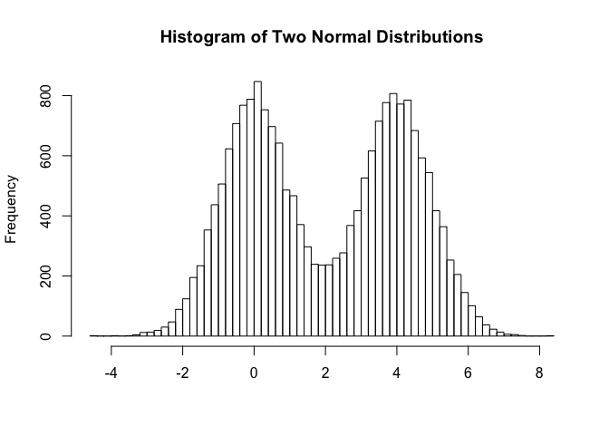
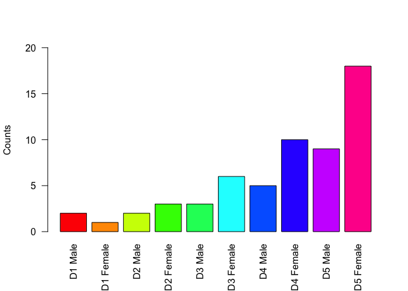
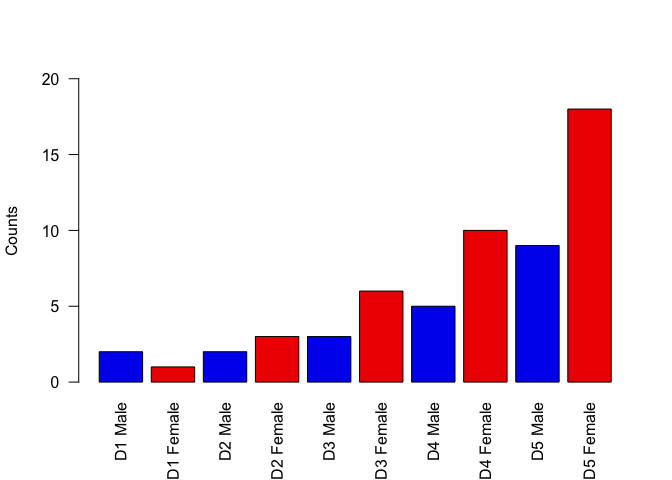
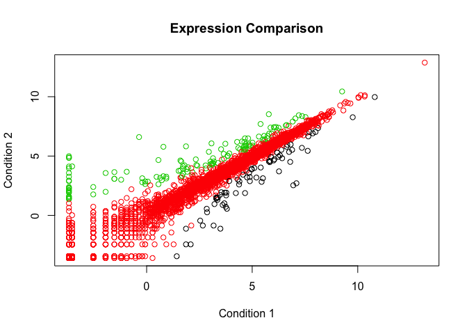
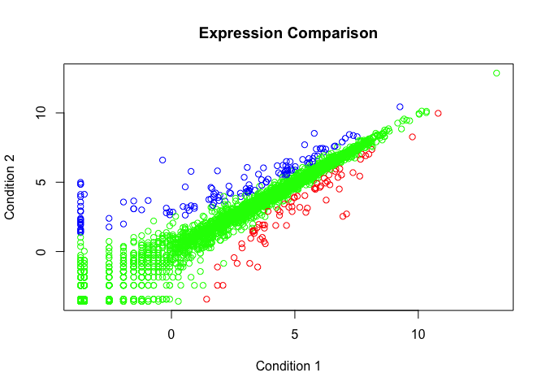
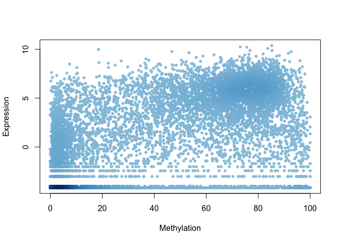
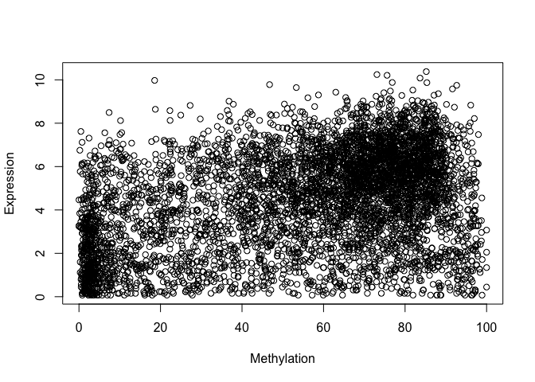
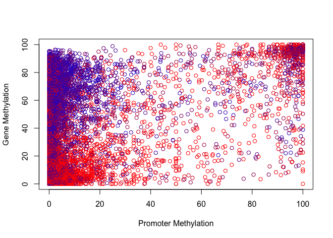

class05
================
Emilya Ventriglia
5/7/2019

Class 05
========

Beginning by working with the Weight data set...
------------------------------------------------

``` r
weight <- read.table("bimm143_05_rstats/weight_chart.txt", header = TRUE)
```

Changing the default parameters for plotting this data set

``` r
plot(weight$Age, weight$Weight, type="o", 
     pch=15, cex=1.5, lwd=2, ylim=c(2,10), 
     xlab="Age (months)", ylab="Weight (kg)", 
     main="Baby Weight Across Age")
```


2B. Barplot
-----------

``` r
feats <- read.delim("bimm143_05_rstats/feature_counts.txt")


par(mar=c(3.1, 11.1, 4.1, 2))
barplot(feats$Count, horiz=TRUE, ylab=" ", 
        names.arg = feats$Feature, 
        main="Quantification of Mouse GRCm38 Genomic Features", 
        las=1, xlim=c(0,80000))
```



2C. Histogram
-------------

``` r
hist(c(rnorm(10000),rnorm(10000)+4),
     breaks=70, main= "Histogram of Two Normal Distributions",
     xlab = " ")
```



Section 3: Using Color
======================

3A. Providing Color Vectors
---------------------------

``` r
mf <- read.delim("bimm143_05_rstats/male_female_counts.txt")


barplot(mf$Count, names.arg=mf$Sample, col=rainbow(nrow(mf)), 
        las=2, ylab="Counts",
        ylim=c(0,20))
```



``` r
barplot(mf$Count, names.arg=mf$Sample, col=c("blue2","red2"), 
        las=2, ylab="Counts",
        ylim=c(0,20))
```



3B. Coloring by Values
----------------------

``` r
genes <- read.delim("bimm143_05_rstats/up_down_expression.txt")


#how many rows are there?
nrow(genes)
```

    ## [1] 5196

``` r
#how many genes are up?
table(genes$State)
```

    ## 
    ##       down unchanging         up 
    ##         72       4997        127

``` r
plot(genes$Condition1, genes$Condition2,
     col=genes$State, main="Expression Comparison",
     xlab="Condition 1", ylab="Condition 2")
```



### Checking what colors are currently used by R to produce colored plots

``` r
palette()
```

    ## [1] "black"   "red"     "green3"  "blue"    "cyan"    "magenta" "yellow" 
    ## [8] "gray"

``` r
#And seeing how the system assigned each availible color to the "State" in the above plot
levels(genes$State)
```

    ## [1] "down"       "unchanging" "up"

Notice that the State outputs were assigned to a color based on first-appearance in the data set.

To reassign colors of our own choosing, we simply generate a new vector of color assignments that correlate to the order we saw from levels().

``` r
#reassigning the colors
palette( c("red","green","blue"))

#plotting with the new color assignments
plot(genes$Condition1, genes$Condition2,
     col=genes$State, main="Expression Comparison",
     xlab="Condition 1", ylab="Condition 2")
```



3C. Dynamic Use of Color
------------------------

### Coloring by Point Density

``` r
meth <- read.delim("bimm143_05_rstats/expression_methylation.txt")

# How many genes are in this data set
nrow(meth)
```

    ## [1] 9241

``` r
plot(meth$gene.meth, meth$expression,
     xlab="Methylation", ylab="Expression")
```


### Since this plot is hard to look at, we'll alter the way the data plots are depicted.

``` r
dcols <- densCols(meth$gene.meth, meth$expression)

# Making the plot, this time with solid dots
plot(meth$gene.meth, meth$expression, col = dcols, pch = 20,
     xlab="Methylation", ylab="Expression")
```



### Now to clean it up based upon those awkward stragglers around the origin, we will be restricting the output to the genes that have more than zero expresion values.

Find the indices of genes with above 0 expresion and plotting this

``` r
inds <- meth$expression > 0

plot(meth$gene.meth[inds], meth$expression[inds],
     xlab="Methylation", ylab="Expression")
```



Make a desnisty color vector for these genes and plot

``` r
dcols <- densCols(meth$gene.meth[inds], meth$expression[inds])

plot(meth$gene.meth[inds], meth$expression[inds], 
     col = dcols, pch = 20,
     xlab="Methylation", ylab="Expression")
```


Finally, changing the colors assigned.

``` r
dcols.custom <- densCols(meth$gene.meth[inds], meth$expression[inds],
                         colramp = colorRampPalette(c("blue2",
                                                      "green2",
                                                      "red2",
                                                      "yellow")) )

plot(meth$gene.meth[inds], meth$expression[inds], 
     col = dcols.custom, pch = 20,
     xlab="Methylation", ylab="Expression")
```


Section 4. Extending on
=======================

4A. Mapping Colors
------------------

``` r
map.colors <- function (value,high.low,palette) {
  proportion <- ((value-high.low[1])/(high.low[2]-high.low[1]))
  index <- round ((length(palette)-1)*proportion)+1
  return (palette[index])
}


# source the provided function so we can use it
source("bimm143_05_rstats/color_to_value_map.r")

mycols=map.colors(meth$expression, 
                  c(max(meth$expression), min(meth$expression)), 
                  colorRampPalette(c("blue","red"))(100))

plot(meth$promoter.meth, meth$gene.meth, 
     ylab="Gene Methylation", 
     xlab="Promoter Methylation", 
     col=mycols)
```


