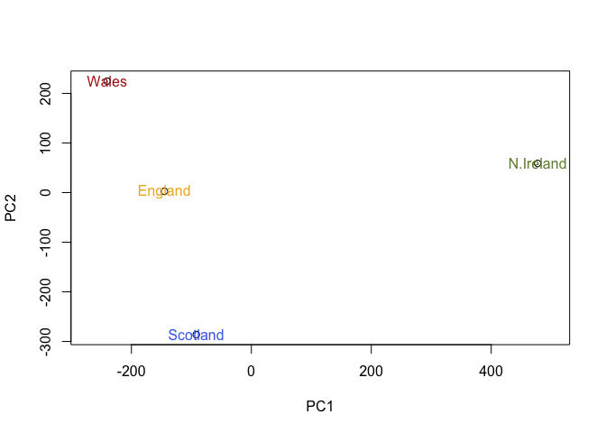

Class 8: Principal Component Analysis (PCA)
================

PCA of UK food data
===================

``` r
x <- read.csv("UK_foods.csv")
```

**Q1.** How many rows and columns are in your new data frame named x? What R functions could you use to answer this questions?

``` r
nrow(x) #rows
```

    ## [1] 17

``` r
ncol(x) #columns
```

    ## [1] 5

``` r
dim(x) #both!
```

    ## [1] 17  5

Looking at our data

``` r
View(x) #entire set

head(x) #look at the first six rows
```

    ##                X England Wales Scotland N.Ireland
    ## 1         Cheese     105   103      103        66
    ## 2  Carcass_meat      245   227      242       267
    ## 3    Other_meat      685   803      750       586
    ## 4           Fish     147   160      122        93
    ## 5 Fats_and_oils      193   235      184       209
    ## 6         Sugars     156   175      147       139

Row names appear erroneous, since there's five instead of the four UK countries. One is being misunderstood as a row but is infact moreso a label.

Correcting for row name/categories

``` r
# Note how the minus indexing works... the more you run this the less rows there will be!
rownames(x) <- x[,1]
x <- x[,-1]
head(x)
```

    ##                England Wales Scotland N.Ireland
    ## Cheese             105   103      103        66
    ## Carcass_meat       245   227      242       267
    ## Other_meat         685   803      750       586
    ## Fish               147   160      122        93
    ## Fats_and_oils      193   235      184       209
    ## Sugars             156   175      147       139

``` r
dim(x) #see? fixed!
```

    ## [1] 17  4

alternative method:

``` r
x <- read.csv("UK_foods.csv", row.names=1)
head(x)
```

    ##                England Wales Scotland N.Ireland
    ## Cheese             105   103      103        66
    ## Carcass_meat       245   227      242       267
    ## Other_meat         685   803      750       586
    ## Fish               147   160      122        93
    ## Fats_and_oils      193   235      184       209
    ## Sugars             156   175      147       139

Spotting major differences and trends
-------------------------------------

Looking at the table isn't very elucidating...and neither is just throwing things into a barplot.

``` r
barplot(as.matrix(x), beside=T, col=rainbow(nrow(x)))
```


And here it is again but where the columns of height are portrayed as stacked bars instead of as juxtaposed bars.

``` r
barplot(as.matrix(x), beside=F, col=rainbow(nrow(x)))
```


Generating a pairwise plot is somewhat more helpful, at least!

``` r
pairs(x, col=rainbow(10), pch=16)
```


But there's a large amount of variables in this data set (seventeen!). Let's run a PCA to better evaluate what variables are truly meaningful from this data.

Observations are expected to be rows and variables are expected to be columns, so we must manipulate our data frame to fit this expectations (transpose it).

``` r
# Use the prcomp() PCA function 
pca <- prcomp( t(x) ) #t is to transpose, so the data is work-withable
summary(pca)
```

    ## Importance of components:
    ##                             PC1      PC2      PC3       PC4
    ## Standard deviation     324.1502 212.7478 73.87622 4.189e-14
    ## Proportion of Variance   0.6744   0.2905  0.03503 0.000e+00
    ## Cumulative Proportion    0.6744   0.9650  1.00000 1.000e+00

``` r
# Plot PC1 vs PC2
plot(pca$x[,1], pca$x[,2], xlab="PC1", ylab="PC2", xlim=c(-270,500))
text(pca$x[,1], pca$x[,2], colnames(x), col = c("goldenrod2","firebrick","royalblue2","darkolivegreen4"))
```



Calculating the variance of the original variables, in the form of the standard deviation.

``` r
v <- round( pca$sdev^2/sum(pca$sdev^2) * 100 )
v
```

    ## [1] 67 29  4  0

or the second row here...

``` r
z <- summary(pca)
z$importance
```

    ##                              PC1       PC2      PC3          PC4
    ## Standard deviation     324.15019 212.74780 73.87622 4.188568e-14
    ## Proportion of Variance   0.67444   0.29052  0.03503 0.000000e+00
    ## Cumulative Proportion    0.67444   0.96497  1.00000 1.000000e+00

Let's visualize this variance using a plot

``` r
barplot(v, xlab="Principal Component", ylab="Percent Variation")
```


Digging Deeper (variable loadings)
----------------------------------

``` r
## Lets focus on PC1 as it accounts for > 90% of variance 
par(mar=c(10, 3, 0.35, 0))
barplot( pca$rotation[,1], las=2 )
```

 THe foods (observations) that have the largest positive loading scores push N. Ireland to the right positive side of the plot, such as soft drinks and fresh potatoes. Those foods with high negative scores will push the other countries to the left side of the plot, such as fresh fruit and alcoholic drinks.

Below is a similar loadings plot for PC2.

``` r
par(mar=c(10, 3, 0.35, 0))
barplot( pca$rotation[,2], las=2 )
```


You can see that fresh potatoes and soft drinks are featured prominantley.

Biplots are also useful because it lets us visualize both the variables and the observations simultaneously.
------------------------------------------------------------------------------------------------------------

``` r
biplot(pca)
```


PCA of RNA-seq data
===================

Accessing a small RNA-seq count data set where the columns are individual samples (cells) and rows are measurements taken for all the samples (genes).

``` r
rna.data <- read.csv("expression.csv", row.names=1)
head(rna.data)
```

    ##        wt1 wt2  wt3  wt4 wt5 ko1 ko2 ko3 ko4 ko5
    ## gene1  439 458  408  429 420  90  88  86  90  93
    ## gene2  219 200  204  210 187 427 423 434 433 426
    ## gene3 1006 989 1030 1017 973 252 237 238 226 210
    ## gene4  783 792  829  856 760 849 856 835 885 894
    ## gene5  181 249  204  244 225 277 305 272 270 279
    ## gene6  460 502  491  491 493 612 594 577 618 638

We'll begin by skipping right to the juicy PCA, rather than waste time with barplots or the like.

``` r
## Again we have to take the transpose of our data 
pca <- prcomp(t(rna.data), scale=TRUE)
 
## Simple un ploished plot of pc1 and pc2
plot(pca$x[,1], pca$x[,2])
```


Using standard deviation to calculate how much variation in the original data that each principal component accounts for.

``` r
## Variance captured per PC 
pca.var <- pca$sdev^2

## Precent variance is often more informative to look at 
pca.var.per <- round(pca.var/sum(pca.var)*100, 1)
pca.var.per
```

    ##  [1] 92.6  2.3  1.1  1.1  0.8  0.7  0.6  0.4  0.4  0.0

Using this variance data to generate a standard scree plot

``` r
barplot(pca.var.per, main="Scree Plot", 
        xlab="Principal Component", ylab="Percent Variation")
```

 Almost all of the variance resides in PC1.

Let's spruce up our PCA plot from before to make it more visually discernable...

``` r
## A vector of colors for wt and ko samples
colvec <- colnames(rna.data)
colvec[grep("wt", colvec)] <- "red"  #all wild types are red
colvec[grep("ko", colvec)] <- "blue"  #all knockouts are blue

plot(pca$x[,1], pca$x[,2], col=colvec, pch=16,
     xlab=paste0("PC1 (", pca.var.per[1], "%)"),
     ylab=paste0("PC2 (", pca.var.per[2], "%)"))

text(pca$x[,1], pca$x[,2], labels = colnames(rna.data), pos=c(rep(4,5), rep(2,5)))
```


here's an alternative to the above coloring mechanism (by sample type)

``` r
#Preparing the sample information to be accessed by the plot parameters...
## Extract the first 2 characters of the sample name
sample.type <- substr(colnames(rna.data),1,2)
sample.type
```

    ##  [1] "wt" "wt" "wt" "wt" "wt" "ko" "ko" "ko" "ko" "ko"

``` r
#and then plotting
plot(pca$x[,1], pca$x[,2], col=as.factor(sample.type), pch=16)
```


Now to find the top 10 measurements (genes) that contribute most to pc1 in either direction (+ or -):

``` r
loading_scores <- pca$rotation[,1]

## Find the top 10 measurements (genes) that contribute
## most to PC1 in either direction (+ or -)
gene_scores <- abs(loading_scores) 
gene_score_ranked <- sort(gene_scores, decreasing=TRUE)

## show the names of the top 10 genes
top_10_genes <- names(gene_score_ranked[1:10])
top_10_genes 
```

    ##  [1] "gene100" "gene66"  "gene45"  "gene68"  "gene98"  "gene60"  "gene21" 
    ##  [8] "gene56"  "gene10"  "gene90"
