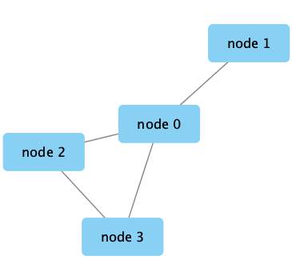
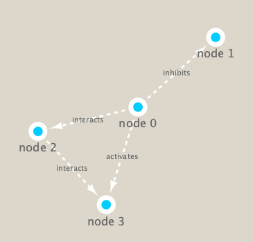
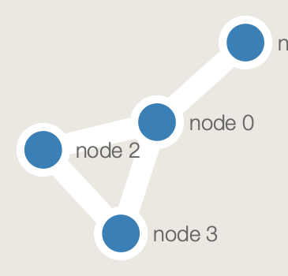

```{r setup, include=FALSE}
knitr::opts_chunk$set(echo = TRUE)
```

```{r}
library(RCy3)
library(igraph)
library(RColorBrewer)
```

```{r}
# Test the connection to Cytoscape.
cytoscapePing()
```
```{r}
# Check the version
cytoscapeVersionInfo()
```

Making a small network
```{r}
g <- makeSimpleIgraph()
createNetworkFromIgraph(g,"myGraph")
```

Including this generated image in our final report
```{r}
fig <- exportImage(filename="demo", type="png", height=350)


```


Changing the defualt visual styles

```{r}
setVisualStyle("Marquee")
```

Looking at the updated figure with the new style
```{r}
fig <- exportImage(filename="demo_marquee", type="png", height=350)


```

Generating a set of what styles are availible to be used
```{r}
styles <- getVisualStyleNames()
styles
```

###Trying out the Solid graph. 
We can use the data set before to simplify the input for the style
```{r}
setVisualStyle(styles[18])

fig <- exportImage(filename="demo_solid", type="png", height=350)


```


ploting our igraph objects in R itself
```{r}
plot(g)
```

#Reading the metagenomics data
##using a species co-occurrence matrix
```{r}
## scripts for processing located in "inst/data-raw/"
prok_vir_cor <- read.delim("virus_prok_cor_abundant.tsv", stringsAsFactors = FALSE)

## Have a peak at the first 6 rows
head(prok_vir_cor)
```

How many unique species are there?
```{r}
length(unique(c(prok_vir_cor[,1],prok_vir_cor[,2])))
```


Using igraph to convert the co-occurrence dataframe into a network, which can then be used with Cytoscape
```{r}
g <- graph.data.frame(prok_vir_cor, directed = FALSE)

class(g)  #checking the class of the object we just created

g
```

IGRAPH 0b6a0eb **UNW- 854 1544** tells that our network graph (Undirected, Named and Weighted) has 845 nodes and 1544 edges.

Plotting with default R function
```{r}
plot(g) #Too dense

plot(g, vertex.label=NA) #removed the labels but still the nodes are too large

plot(g, vertex.size=3, vertex.label=NA) #making the nodes small = just right!
```

##Community structure detection
###Girvan & Newman betweenness clustering method
```{r}
cb <- cluster_edge_betweenness(g)

cb
```

We'll now graph our network again, this time with the clusters denoted
```{r}
plot(cb, y=g, vertex.label=NA,  vertex.size=3) 
#see that we plot the iGraph data straight into R, where the Y coordinates are our original plot g
```

Taking a closer look at how many are in each cluster by generating a vector
```{r}
head( membership(cb) )
```

##Structural properties: Vertex
###calculating and plotting the node degree distribution
```{r}
# Calculate and plot node degree of our network
d <- degree(g)
hist(d, breaks=30, col="lightblue", main ="Node Degree Distribution")
```

```{r}
plot( degree_distribution(g), type="h" )
```

##Centrality analysis
###Determining whcih nodes are the most impactful and which aren't in the network

using the PageRank algorithm
```{r}
pr <- page_rank(g)
head(pr$vector)
```

plot our network with nodes size scaled via this page rank centrality scores

Using the PageRank centrality scores to plot our network (the nodes are scaled to the centrality scores)
```{r}
# Make a size vector btwn 2 and 20 for node plotting size
v.size <- BBmisc::normalize(pr$vector, range=c(2,20), method="range")
plot(g, vertex.size=v.size, vertex.label=NA)
```

#Read taxonomic classification for network annotation
```{r}
phage_id_affiliation <- read.delim("phage_ids_with_affiliation.tsv")
head(phage_id_affiliation)
```
```{r}
bac_id_affi <- read.delim("prok_tax_from_silva.tsv", stringsAsFactors = FALSE)
head(bac_id_affi)
```

##Add taxonomic annotation data to network
###More prep to send to cytoscape

```{r}
## Extract out our vertex names
genenet.nodes <- as.data.frame(vertex.attributes(g), stringsAsFactors=FALSE)
head(genenet.nodes)
```

How may phage (i.e. ph_) entries do we have?
```{r}
length( grep("^ph_",genenet.nodes[,1]) )
```
Leaving there to be 81 non-phage nodes.

###merging with the annotation data
```{r}
# We dont need all annotation data so lets make a reduced table 'z' for merging
z <- bac_id_affi[,c("Accession_ID", "Kingdom", "Phylum", "Class")]
n <- merge(genenet.nodes, z, by.x="name", by.y="Accession_ID", all.x=TRUE)
head(n)
```

```{r}
# Check on the column names before deciding what to merge
colnames(n)

colnames(phage_id_affiliation)
```
See that there is clearly superfluous colomns/data in the original set? We need to clean this up for the annotation.

```{r}
# Creating a subset of `phage_id_affiliation`; having only the columns we want for the annotation
y <- phage_id_affiliation[, c("first_sheet.Phage_id_network", "phage_affiliation","Tax_order", "Tax_subfamily")]

# Add the little phage annotation that we have
x <- merge(x=n, y=y, by.x="name", by.y="first_sheet.Phage_id_network", all.x=TRUE)

## Remove duplicates from multiple matches
x <- x[!duplicated( (x$name) ),]
head(x)

#saving this to our original name to use henceforth
genenet.nodes <- x
```

##Using Rcy3 to export the network to cytoscape

We must modify the data slightly for cytoscape. *"We will need to set the first column in our node data.frame to id as this is what the RCy3 function createNetworkFromDataFrames() expects. Note that additional columns are loaded into Cytoscape as node attributes

Likewise the edge data.frame should contain columns of character strings named: source, target and interaction (with additional columns loaded as edge attributes)."*
```{r}
# Open a new connection and delete any existing windows/networks in Cy
deleteAllNetworks()

# Set the main nodes colname to the required "id" 
colnames(genenet.nodes)[1] <- "id"
```


```{r}
genenet.edges <- data.frame(igraph::as_edgelist(g))

# Set the main edges colname to the required "source" and "target" 
colnames(genenet.edges) <- c("source","target")

# Add the weight from igraph to a new column...
genenet.edges$Weight <- igraph::edge_attr(g)$weight

# Send as a new network to Cytoscape
createNetworkFromDataFrames(genenet.nodes,genenet.edges, 
                            title="Tara_Oceans")
```


